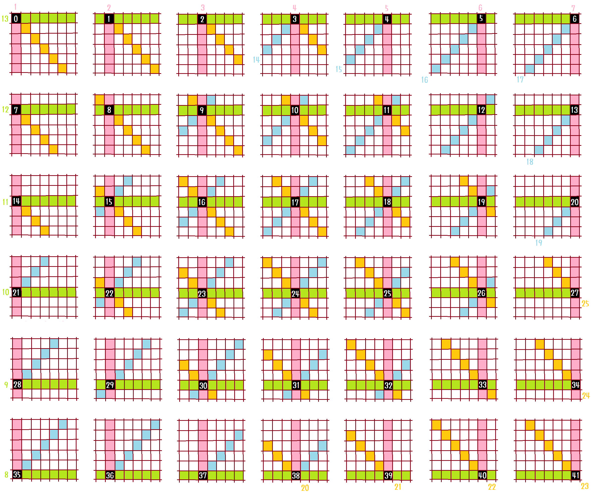
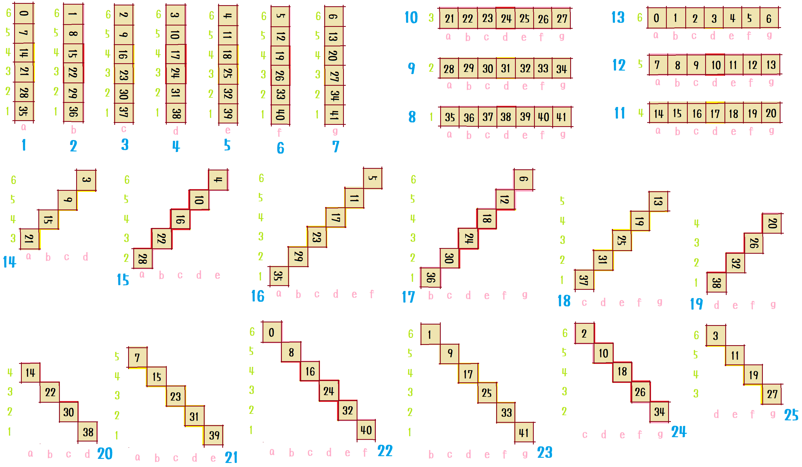
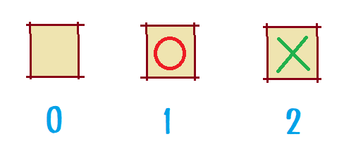
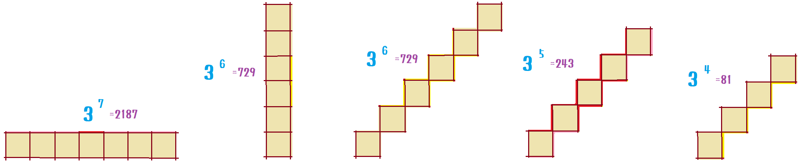

# kifuwarabe-connect-four

Note: Currently, the thinking part is **not working** yet. I don't know if I can make it.  
注：現在、思考部はまだ **機能していません** 。作れるかわかりません。  

Programming computer shogi (Japanese chess) is difficult.  
コンピュータ将棋のプログラミングは難しいです。  

How can I improve my programming skills?  
プログラミングスキルを向上させるにはどうすればよいですか？  

A strategy of gradually stepping up from a simple game is not appropriate.  
単純なゲームから徐々にステップアップする戦略は適切ではありません。  

The reason is that the right program to solve the problem depends entirely on the game. Unless you have general artificial intelligence.  
その理由は、問題を解決するための適切なプログラムが完全にゲームに依存しているためです。汎用人工知能を持っていない限り。  

I recommend that you write computer shogi software directly, rather than bypassing it.  
迂回するのではなく、コンピューター将棋ソフトウェアを直接作成することをお勧めします。  

Of course it's best to start by modifying the strongest library. Helps to find out what is missing.  
もちろん、最強のライブラリを変更することから始めるのが最善です。 何が欠けているかを知るのに役立ちます。  

However, if you want to overcome the weaknesses of basic programming skills unrelated to computer shogi, it makes sense to start with a simple program.  
ただし、コンピュータ将棋とは関係のない基本的なプログラミングスキルの弱点を克服したい場合は、単純なプログラムから始めるのが理にかなっています。  

Connect-four games, for example, are so vast that they can't be fully explored on home computers, but they're easy to run and their skills are easy to check.  
たとえば、四目並べゲームは非常に広大なので、家庭用コンピューターで完全探索することはできませんが、実行は簡単で、スキルのチェックは簡単です。  

Computer shogi, computer go program Kifuwarabe has been converted into connect-four.  
コンピュータ将棋、コンピュータ囲碁プログラム「きふわらべ」を４目並べに変換しました。  

It was implemented with an unspecified UXI protocol that imitates the UCI / USI protocol. X has no meaning.　 
UCI / USIプロトコルを模した未指定のUXIプロトコルで実装しました。 X に意味はありません。  

Come see the repository.  
リポジトリをご覧ください。  

There is **no** GUI (Graphical user interface). Thought engine only.  
GUIは **ありません**。思考エンジンのみです。  

## Run

Note: **Not currently a library** . It will be converted to a library in a later update.  
注： **現在ライブラリではありません** 。後のアップデートでライブラリに変換します。  

Terminal:  

```shell
cargo run
```

In game:  

```plain
casual_logger   | Remove 0 log file(s).
                | If you don't want this message, set `Log::set_opt(Opt::Release);`.
Hello, world!
こんにちわ、世界！！
Nought=|O|

... Test run. Omitted ...

Kifuwarabe's connect-four
きふわらべのコネクト・フォー

Command:
コマンド:
`do d`      - Mark the d file.
                手番のプレイヤーが、 7 列目に印を付けます。
`go`        - The computer shows the next move.
                コンピューターが次の1手を示します。
`info-off`  - no info output.
                info出力なし。
`info-on`   - There is info output.(Default)
                info出力あり(既定)。
`learn`     - Learning.
                学習。
`pos`       - Position display.
                局面表示。
`position xfen 7/7/7/7/7/7 O moves d c`
            - Starting position and moves.
                初期局面と棋譜を入力。
`uh`        - Step of learning.
                学習のステップ。
`undo`      - 1 back.
                1手戻します。
`uxi`       - Returns 'uxiok connect-four {protocol-version}'. It is a version of the protocol, not software.
                'uxiok connect-four {protocol-version}' を返します。ソフトではなくプロトコルのバージョンです。
`xfen`      - The current xfen string display.
                現局面のxfen文字列表示。

Let's input from `pos`.
`pos` から入力してみましょう。
```

Input in game:  

A file of **about 262 KB** is automatically generated, so be careful of free disk space.  
**約262KB** のファイルが自動生成されますので、空き容量にご注意ください。  

Oops, a large log file will also be output, so make sure you have **about 100 MB or more** free. **It grows bigger and bigger. Erase it manually if you think it is dangerous.**  
おっと、大きなログファイルも出力されるので、 **約100MB以上** の空きがあることを確認してください。 **それはますます大きくなります。 危険と思われる場合は手動で消去してください。**  

```plain
learn
```

Output in game:  

```plain
... Omitted ...

[Learn]
     | Feature number      | Current evaluation        | Choice way    | Give                           | Take                                | Refund
File | Vert Hori Baro Sini | Vert Hori Baro Sini Total | File   Result | Val  Vert Hori Baro Sini Total | Val  Rest Vert Hori Baro Sini Total | Val  Vert Hori Baro Sini Total
---- + ---- ---- ---- ---- + ---- ---- ---- ---- ----- + ------ ------ + ---- ---- ---- ---- ---- ----- + ---- ---- ---- ---- ---- ---- ----- + ---- ---- ---- ---- ---- -----
   a |    1    8   16    . |    6   57   60    .   123 | a      Win    |    4    4   49   59    .   112 |    7    .    7   57   61    .   125 |    .    7   57   61    .   125
   b |    2    8   17    . |    .   57    2    .    59 | b      Win    |    4    .   49    .    .    49 |    7    .    3   57    2    .    62 |    .    3   57    2    .    62
   c |    3    8   18    . |    3   57   59    .   119 | resign Lose   |    4    1   49   58    .   108 |    .    .    1   57   58    .   116 |    .    1   57   58    .   116
   d |    4    8   19   20 |   69   57   34    5   165 | d      Win    |    4   68   49   33    4   154 |    7    .   70   57   35    5   167 |    .   70   57   35    5   167
   e |    5    8    .   21 |    3   57    .   12    72 | e      Win    |    4    1   49    .   11    61 |    7    .    4   57    .   13    74 |    .    4   57    .   13    74
   f |    6    8    .   22 |    6   57    .   41   104 | resign Lose   |    4    4   49    .   40    93 |    .    .    4   57    .   40   101 |    .    4   57    .   40   101
   g |    7    8    .   23 |    3   57    .    3    63 | resign Lose   |    4    1   49    .    2    52 |    .    .    1   57    .    2    60 |    .    1   57    .    2    60

... Omitted ...
```

Note: I want a strong thinking part, but **I don't think it helps**.  
The evaluation points are distributed by adding and subtracting integers without using differentiation or real numbers.  
注意: 強力な思考部が欲しいのですが、それは **役に立たないと思います。**  
評価値は、微分や実数を使用せずに、整数を加算および減算することによって分配されます。  

Input in game:  

```plain
pos
```

Output in game:  

```plain
[Next 1 piece(s) | Go O]

  +---+---+---+---+---+---+---+ Please select a file. Example `do d`
6 |   |   |   |   |   |   |   | 列を選んでください。例 `do d`
  +---+---+---+---+---+---+---+
5 |   |   |   |   |   |   |   |    a b c d e f g
  +---+---+---+---+---+---+---+
4 |   |   |   |   |   |   |   |
  +---+---+---+---+---+---+---+
3 |   |   |   |   |   |   |   |
  +---+---+---+---+---+---+---+
2 |   |   |   |   |   |   |   |
  +---+---+---+---+---+---+---+
1 |   |   |   |   |   |   |   |
  +---+---+---+---+---+---+---+
    a   b   c   d   e   f   g
```

Input in game:  

```plain
do d
pos
```

Output in game:  

```plain
[Next 2 piece(s) | Go X]

  +---+---+---+---+---+---+---+ Please select a file. Example `do d`
6 |   |   |   |   |   |   |   | 列を選んでください。例 `do d`
  +---+---+---+---+---+---+---+
5 |   |   |   |   |   |   |   |    a b c d e f g
  +---+---+---+---+---+---+---+
4 |   |   |   |   |   |   |   |
  +---+---+---+---+---+---+---+
3 |   |   |   |   |   |   |   |
  +---+---+---+---+---+---+---+
2 |   |   |   |   |   |   |   |
  +---+---+---+---+---+---+---+
1 |   |   |   | O |   |   |   |
  +---+---+---+---+---+---+---+
    a   b   c   d   e   f   g
```

Input in game:  

```plain
go
```

Output in game:  

```plain
info json { "nps":     1, "nodes":     1, "push":"f"                                                   , "O":"Search.", "channel1":Win, "choose":"f", "total":475, "a":28, "b":70, "c":69, "d":147, "e":64, "f":59, "g":38, "pv":["d","f"] }
info json { "nps":     2, "nodes":     2, "push":"d"                                                   , "X":"Search.", "channel1":Win, "choose":"d", "total":470, "a":93, "b":30, "c":84, "d":139, "e":42, "f":54, "g":28, "pv":["d","f","d"] }
info json { "nps":     3, "nodes":     3, "push":"d"                                                   , "O":"Search.", "channel1":Win, "choose":"d", "total":463, "a":29, "b":71, "c":54, "d":147, "e":62, "f":61, "g":39, "pv":["d","f","d","d"] }
i

... omitted ...

info string pred_result=Win nps=23
bestmove f
```

Input in game:  

```plain
do f
pos
```

Output in game:  

```plain
[Next 3 piece(s) | Go O]

  +---+---+---+---+---+---+---+ Please select a file. Example `do d`
6 |   |   |   |   |   |   |   | 列を選んでください。例 `do d`
  +---+---+---+---+---+---+---+
5 |   |   |   |   |   |   |   |    a b c d e f g
  +---+---+---+---+---+---+---+
4 |   |   |   |   |   |   |   |
  +---+---+---+---+---+---+---+
3 |   |   |   |   |   |   |   |
  +---+---+---+---+---+---+---+
2 |   |   |   |   |   |   |   |
  +---+---+---+---+---+---+---+
1 |   |   |   | O |   | X |   |
  +---+---+---+---+---+---+---+
    a   b   c   d   e   f   g
```

Input in game:  

```plain
xfen
```

Output in game:  

```plain
xfen 7/7/7/7/7/7 O moves d f
```

Input in game:  

```plain
position xfen 7/7/7/7/XOXOXOX/OXOXOXO O moves d f
pos
```

Output in game:  

```plain
[Next 17 piece(s) | Go O]

  +---+---+---+---+---+---+---+ Please select a file. Example `do d`
6 |   |   |   |   |   |   |   | 列を選んでください。例 `do d`
  +---+---+---+---+---+---+---+
5 |   |   |   |   |   |   |   |    a b c d e f g
  +---+---+---+---+---+---+---+
4 |   |   |   |   |   |   |   |
  +---+---+---+---+---+---+---+
3 |   |   |   | O |   | X |   |
  +---+---+---+---+---+---+---+
2 | X | O | X | O | X | O | X |
  +---+---+---+---+---+---+---+
1 | O | X | O | X | O | X | O |
  +---+---+---+---+---+---+---+
    a   b   c   d   e   f   g
```

Input in game:  

```plain
quit
```

## Evaluation design

**Does not work.** You should make the thinking part.  
**働きません。** あなたは考える部分を作るべきです。  

### Elemental features

Numbered the lines that intersect the squares.  
マスに交差する線に番号を付けました。  

elemental features:  

  

features square:  

  

square value:  

  

feature size:  

  

## How to program a connect-four game?

During development, you may need to reproduce the behavior of your computer.  
It is difficult to compare the behavior. Instead, it is useful to get the logs and compare the logs.  
**But logger's difficult to make, so use library.**  

* [x] Step 1. Use logger library.
  * [x] Use casual_logger library at 'Cargo.toml', 'main.rs'.
  * [x] Create the 'log.rs' file.
    * [x] Extend the logger.

Let's proceed with development while testing.  

* [ ] Step 2. Create the `test.rs` file.
  * Add little by little as you progress through the steps.  

The first thing you have to create is your motive.  
It is important to start with the appearance.  

* [x] Step 3. Create the 'main.rs' file and 'look_and_model.rs' file.
  * [x] Engine - Title screen.
  * [x] Piece - "O", "X".
  * [x] Game result - Win/Draw/Lose.
  * [x] Position - It's the board.
  * [x] Search - Computer player search.
  * [x] Search info - Computer player search info.

If you want to play immediately, you have the talent of a game creator.  
Being able to control your position means being able to play.  

* [x] Step 4. Create the 'position.rs' file.
  * [x] do_move
  * [x] undo_move
  * [x] opponent

Let's enter commands into the computer. Create a command line parser.  

* [x] Step 5. Create the 'command_line_seek.rs' file.
  * [x] Starts with.
  * [x] Go next to.
  * [x] Rest.

People who are looking for something 10 minutes a day are looking for something for a week in a year.  
Before creating the game itself, let's first create the replay function. Let's get it for a week.  

* [x] Step 6. Create the 'uxi_protocol.rs' file.
  * [x] Do. (Before 'From XFEN') Excludes legal moves and winning/losing decisions.
  * [x] To XFEN.
  * [x] From XFEN.
  * [x] Undo.

Let's make a principal command.  

* [x] Step 7. Create the 'engine.rs' file. Command line.
  * [x] position.
  * [x] pos.
  * [x] do.
  * [x] undo.
  * [x] uxi.
  * [x] xfen.
* [x] Step 8. 'src/main.rs' or 'examples/main.rs'.

Before you make a computer player, let's judge the outcome. And let's test.  

* [x] Step 9. 'win_lose_judgment.rs'
  * [x] Win.
  * [x] Draw - Not win, not lose, can not play.
  * [x] Lose. - Not win is lose.

Before creating a computer player, let's create a mechanism to measure performance.  

* [x] Step 10. 'performance_measurement.rs'
  * [x] Seconds. - Stopwatch.
  * [x] Node per second.

Let's make a computer player.  

* [x] Step 11. 'computer_player/search.rs'
  * [x] Search.
* [x] 'main.py'
  * [x] Create "go" command.

Let's larning a computer thinking.

* [x] Step 12. 'computer_player/evaluation.rs'
  * [x] Evaluation - None.
    * [x] ways_weight.
    * [x] Save.
    * [x] Load.
    * [x] Get value.
    * [x] Set value.
    * [ ] Print some feature.
  * [ ] Allocation functions.
    * [ ] TODO `posval` command.
    * [ ] TODO `posdiffval {file}` command.
    * [ ] TODO `posdifffeat {file}` function.
* [ ] Step 13. `computer_player/learn.rs`

Finally.

* [ ] Remeve all 'TODO' tasks. Examples: '// TODO Write a code here.'
